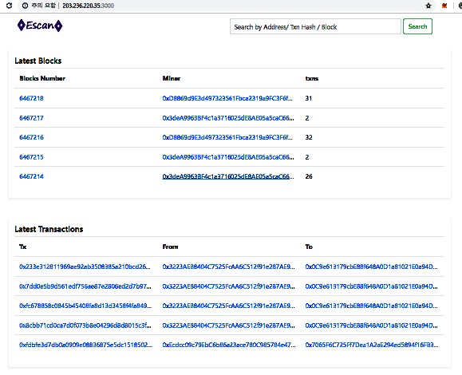
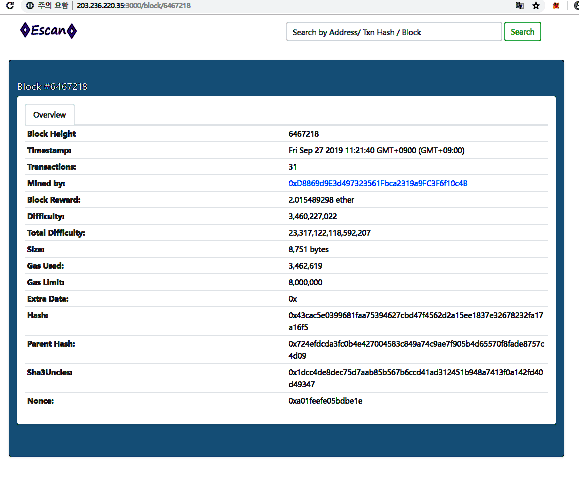
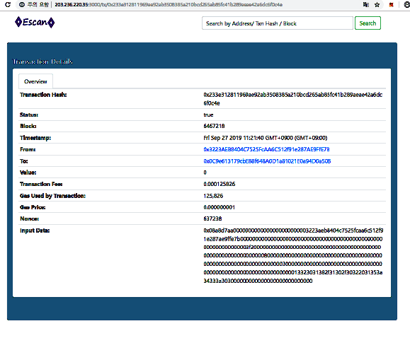
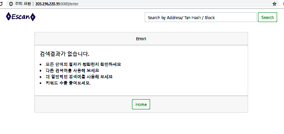

# Etherscan

이더리움 네트워크의 Address, Transaction, Block 의 정보를 조회하는 웹 페이지

### 사용방법
 1. 소스 내려받고 서버 실행하는 법
```
$ git clone https://github.com/Hyun-Geol/etherscan.git
$ cd etherscan
$ npm i
$ npm start
```
http://localhot:3000 으로 접속하시면 됩니다.

 2. 메인페이지(BlcokList,TxList)
	
 3. BlockInfo
	
 4. AddressBalance
	
 5. TransactionInfo
	
 6. errorPage
	